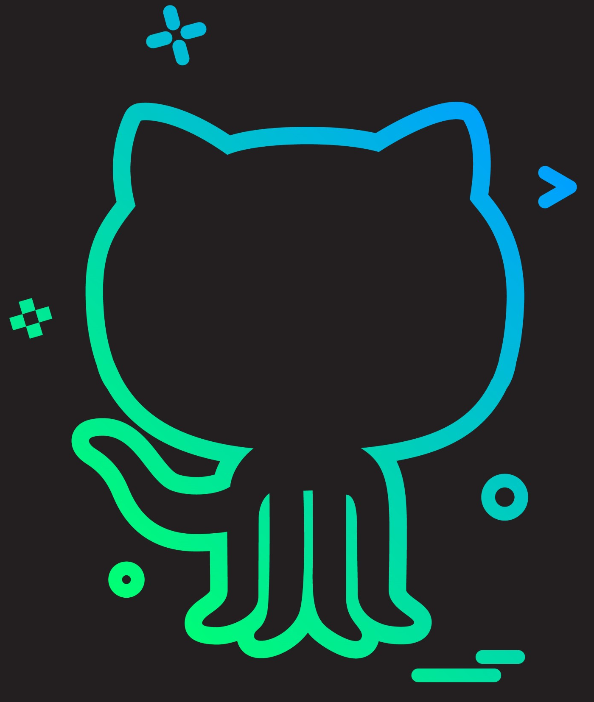

<h2 align="center"> About me </h2>

I am <b>RexTD</b>, better known as 'Tuan Dat' 
I am <strong>Vietnamese</strong> guy who enjoys creating new things, was majoring in Information Technology at RMIT University  
Constant learning of new things, and meeting incredible people are my favorite activities. 
Oh, and yes if you want someone to collaborate with some new incredible projects, <b>I AM YOUR GUY</b>

<h1 align="center"> Languages/Frameworks I'm good at: </h1>

  <code></code>
  <code></code>
  <code></code>
  <code></code>
  <code></code>
  <code></code>
  <code></code>

 

<h1 align="center"> Languages/Frameworks I am also working on: </h1>

  <code></code>
  <code></code>
  <code></code>
  <code></code>
  <code></code>

 

<h1 align="center"> Environments I work with: </h1>

  <code></code>
  <code></code>
  <code></code>
  <code></code>

 
